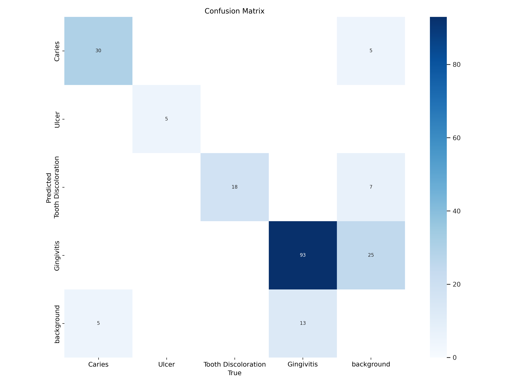
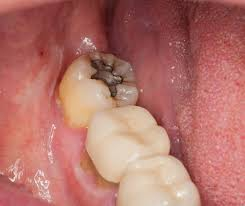
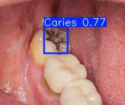

# 🦷 Dental Disease Detection using YOLOv8 + Streamlit

This project is a web-based application for detecting **dental diseases** using deep learning and the YOLOv8 object detection model. It provides **visual detection**, **smart suggestions**, and **PDF report generation** from photographic dental images.

---

## 💡 Features

- 🎯 Detects 4 dental conditions:
  - Caries
  - Ulcer
  - Tooth Discoloration
  - Gingivitis
- 📸 Accepts image upload or camera input
- 🔍 AI detection using a trained YOLOv8 model
- 🧠 Disease-specific health suggestions
- 🖼️ Annotated result visualization
- 📄 Generates downloadable PDF reports
- 🖥️ User-friendly **Streamlit** interface
- ✅ Command-line detection support (`detect.py`)

---

## 📁 Folder Structure

```
Dental-Disease-Detection/
├── app.py                     # Streamlit frontend app
├── detect.py                  # CLI-based image detector
├── requirements.txt           # Python dependencies
├── weights/
│   └── best.pt                # Trained YOLOv8 model
├── assets/
│   └── background.jpg         # Background image for app
├── training_info/
│   ├── train.jpg
│   ├── confusion_matrix.png
│   ├── pr_curve_all_classes.png
│   ├── results.csv
│   └── data.yaml
└── README.md
```

---

## 🛠️ Installation

### 🔹 Step 1: Clone the Repo

```bash
git clone https://github.com/Mukil2004/Dental-Disease-Detection-using-yolo-v8.git
cd Dental-Disease-Detection-using-yolo-v8
```

### 🔹 Step 2: Install Requirements

```bash
pip install -r requirements.txt
```

---

## 🚀 Run the App

### 🔹 Launch Streamlit App

```bash
streamlit run app.py
```

Then open the link shown in the terminal (usually http://localhost:8501).

### 🔹 Use the Command-Line Detector

```bash
python detect.py --weights weights/best.pt --source your_image.jpg --output-dir output/ --save
```

---

## 📈 Model Training Info

Trained using YOLOv8 on photographic dental images with 4 classes.

### 🔹 Training Curve


### 🔹 Confusion Matrix



### 🔹 PR Curve


---

## 📋 Sample Output

|           Input                   |               Detection             |
|-----------------------------------|-------------------------------------|
|  |  |

---

## 📦 Dependencies

- `streamlit`
- `ultralytics`
- `torch`
- `Pillow`
- `reportlab`
- `numpy`, `os`, `tempfile`, etc.

All are listed in `requirements.txt`.

---

## ⚠️ Disclaimer

This is an AI-based tool for **preliminary analysis**. It does **not replace professional dental diagnosis**. Always consult a licensed dentist for treatment decisions.

---

## 🙋‍♂️ Author

**Mukil S.E**  
B.Tech CSE Core, SRMIST  
🔗 GitHub: [@Mukil2004](https://github.com/Mukil2004)

---

## ⭐ Show Some Love!

If you find this project helpful, please **star ⭐ this repository** and share it!
